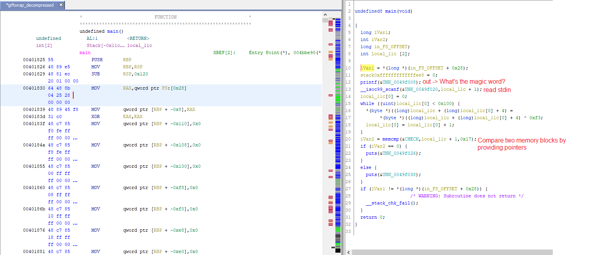
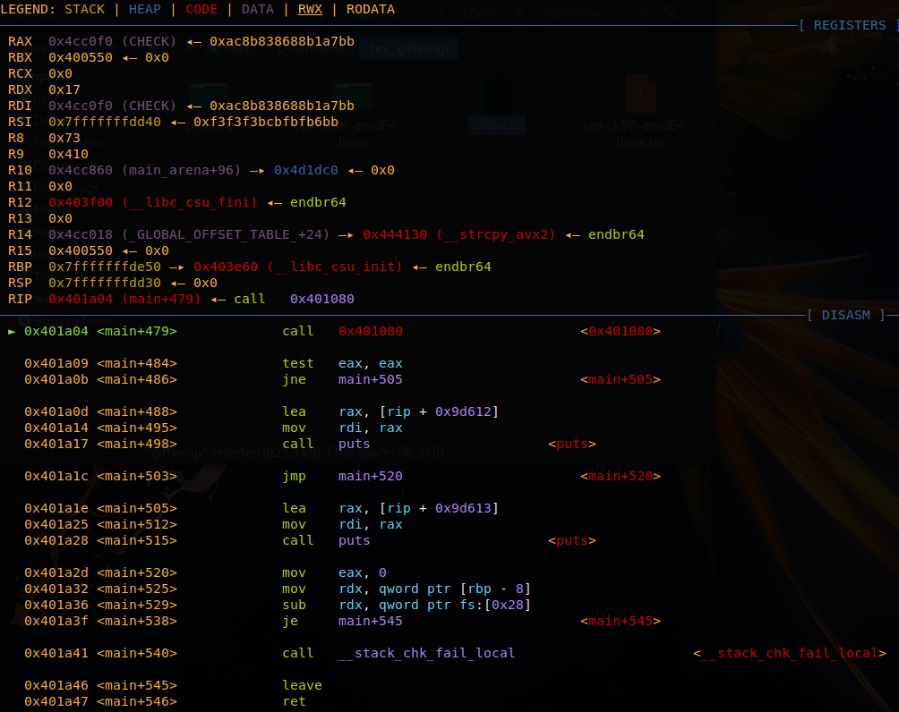

# HTB Gift Wrapping Writeup
HackTheBox 2021 - Cyber Santa is Coming to Town  CTF

This is a writeup for the **reversing** challenge from the 2021 HTB Christmas (*Cyber Santa is Coming to Town*) CTF.

After unpacking the binary I ran `file giftwrap` and `binwalk giftwrap` to get a sense of what binary we are dealing with. And the binary itself.
> ELF 64-bit LSB executable 


Loading the binary into Ghidra revealed ... well not much. It seems the binary is somehow compressed or packed. So I ran the built-in string search and found two interesting candidates.

So the binary is indeed packed/compressed with [upx](https://upx.github.io/). After a quick google search, I found a [tool](https://github.com/upx/upx) for decompressing the binary.  
let's run it with:
`upx -d -v giftwrap `
and load it into Ghidra once again.
Now we can identify a `main` function at `0x401825` to reverse.

Nothing special here, the binary outputs some text and reads some chars from the stdin. 
And then it calls a *kind of compare* function at `0x401a04` with two pointers, one of the named **CHECK**. 
Actually before i loaded the decompressed binary into ghidra i ran it with `gdb` and discovered the strange function at `0x401a04` is [memcmp](https://www.cplusplus.com/reference/cstring/memcmp/) :
```c++
int memcmp ( const void * ptr1, const void * ptr2, size_t num );
```
>from https://www.cplusplus.com: <br>Compare two blocks of memory<br>
Compares the first _num_ bytes of the block of memory pointed by _ptr1_ to the first _num_ bytes pointed by _ptr2_, returning zero if they all match or a value different from zero representing which is greater if they do not.

That means our *CHECK* pointer points to a block of memory.
```iVar2 = memcmp(&CHECK,local_11c + 1,0x17);```

Following  *CHECK* we can find the following memory block.

Unfortunatally we can't read any data, cause before comparing the input string there is some magic happening on the user supplied input. 
```c
__isoc99_scanf(&UNK_0049f020,local_11c + 1);
local_11c[0] = 0;
while ((uint)local_11c[0] < 0x100) {
    *(byte *)((long)local_11c + (long)local_11c[0] + 4) =
         *(byte *)((long)local_11c + (long)local_11c[0] + 4) ^ 0xf3;
    local_11c[0] = local_11c[0] + 1;
  }
```
I was too lazy to reverse this part so I decided to run the binary with gbd/pwndbg and check the inputs to `memcmp`.

So let's keep an eye on the registers `RDI` which contains the pointer to our secret memory block and `RSI` which contains the user-supplied obfuscated data. 

 
 We can see that `RDI` contains the pointer `0x4cc0f0` to our memory block and it contains part of our memory data `0xac8b838688b1a7bb` that we also observed with Ghidra.
 I decided to feed the binary with different characters and stop before every call to `memcmp` to check how the input characters (in `RSI` from right to left) are changed by the obfuscation function. After running a few times a got the following alphabet:
 
|A|B|C|D|E|F|G|...|{|_|}|a|b|c|...|
|--|--|--|--|--|--|--|--|--|--|--|--|--|--|--|
|b2|b1|b0|b7|b6|b5|b4|...|88|ac|8e|92|91|90|...

                 
    CHECK                                  XREF[1]:     Entry Point(*)  
    004cc0f0 bb              ??         BBh    == H                                      
    004cc0f1 a7              ??         A7h    == T                                          
    004cc0f2 b1              ??         B1h    == B                                          
    004cc0f3 88              ??         88h    == {
    004cc0f4 86              ??         86h    == u
    004cc0f5 83              ??         83h    == p
    004cc0f6 8b              ??         8Bh    == x
    004cc0f7 ac              ??         ACh    == _
    004cc0f8 c7              ??         C7h    == 4
    004cc0f9 c2              ??         C2h    == 1
    004cc0fa 9d              ??         9Dh    == n
    004cc0fb 87              ??         87h    == t
    004cc0fc ac              ??         ACh    == _
    004cc0fd c6              ??         C6h    == 5
    004cc0fe c3              ??         C3h    == 0
    004cc0ff ac              ??         ACh    == _
    004cc100 9b              ??         9Bh    == h
    004cc101 c7              ??         C7h    == 4
    004cc102 81              ??         81h    == r
    004cc103 97              ??         97h    == d
    004cc104 d2              ??         D2h    == !
    004cc105 d2              ??         D2h    == !
    004cc106 8e              ??         8Eh    == }
    004cc107 00              ??         00h

 Reversing each char from the mem block with our table we end up with the flag: 
*HTB{upx_41nt_50_h4rd!!}*

 


